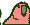

  

        <h1>YelpCamp</h1> 
    

    

        YelpCamp is a project developed in "The Web Developer Bootcamp 2022" Udemy course
        

        The website is basically a helper for people find a campground to stay
        

    

    
 
    <h2>Dependencies</h2> 
    
    

    

  <h1>CRUD</h1>
  

  <h1>Validations (Front and backend)</h1>
  

